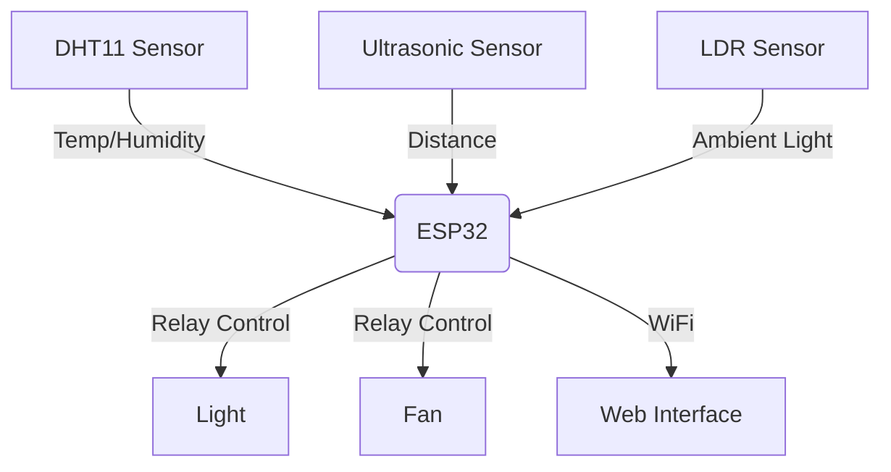

# 🌡️ IoT Smart Room Controller - ESP32 Automation System  
**Automated climate & lighting control using DHT11, Ultrasonic, and LDR sensors with web interface**  
*"Your Room, Smarter."*  

[](https://opensource.org/licenses/MIT)
[](https://www.espressif.com/)

---

## 📂 Project Files
- **Main Controller**: `smart_room_controller.ino`

---

## 🌟 Key Features
- 🕹️ Dual-mode operation (Auto/Manual)
- 🌡️ Temperature-triggered fan control
- 💡 Light-sensitive lighting with LDR
- 👤 Presence detection via ultrasonic sensor
- 🌐 Web dashboard for remote control
- 🔄 Real-time sensor monitoring

---

## 🛠️ Hardware Architecture


---

## 🚀 Quick Start
1. **Hardware Setup**
   ```python
   Connections:
   DHT11   -> GPIO14
   HC-SR04 -> Trig:GPIO12, Echo:GPIO13
   LDR     -> GPIO33
   Relay1  -> GPIO27 (Light)
   Relay2  -> GPIO26 (Fan)
   ```

2. **Configure WiFi**
   ```cpp
   const char* WiFi_name = "YOUR_SSID";
   const char* WiFi_pass = "YOUR_PASSWORD";
   ```

3. **Upload & Monitor**
   ```bash
   PlatformIO CLI:
   pio run -t upload && pio device monitor
   ```

---

## 🔧 Technical Specifications
| Component       | Function                     | GPIO  |
|-----------------|------------------------------|-------|
| DHT11           | Temperature/Humidity         | 14    |
| HC-SR04         | Presence Detection           | 12,13 |
| LDR             | Ambient Light Sensing        | 33    |
| Relay Module    | Light/Fan Control            | 26,27 |

---

## 💡 Advanced Customization
```cpp
// Auto-mode thresholds (modify as needed)
#define TEMP_THRESHOLD 20.0    // °C
#define DISTANCE_THRESHOLD 10  // cm
```

---

## 🌐 IoT Integration Roadmap
- [ ] MQTT Support for Home Assistant
- [ ] Firebase Realtime Database Logging
- [ ] OTA (Over-the-Air) Updates
- [ ] Energy Consumption Monitoring

---

## 📜 License
MIT © Challa Gnan Pavan 
*"Making automation human-friendly since 2024"*  
